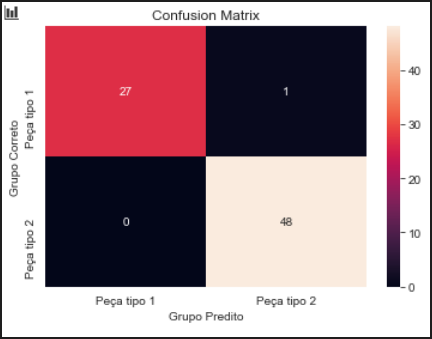

### Trabalho final e exercícios da matéria de Redes Neurais (Pós ML e Sistemas inteligentes)

Integrantes: João Victor Baesso e João Victor Scanagatta

## Resumo trabalho final:
Inicialmente foi avaliado a relação entre as colunas com o uso da Matriz de Correlação (usando o seaborn) e nela verificado que apenas a coluna da hora não tem uma relação significativa com as variáveis alvo, portanto foi removido apenas a coluna da hora e mantido todas as outras (Tamanho, Referencia, NumAmostra, Area e Delta). Foi então aplicado uma normalização nos dados e separado os dados em conjunto de treinamento (71%) e teste (29%). Também foi adicionada mais uma camada oculta à rede, que ficou com a seguinte arquitetura: 5 neurônios de entrada, seguidos de 9 neurônios (1ª camada oculta), 5 neurônios (2ª camada oculta) e 2 neurônios na camada de saída, e utilizando learningRate de 0.2. Utilizando 4000 épocas de treino foi obtido uma acurácia de 98,7% e uma taxa de erro final de 0.027.
Com o modelo inicial foi obtido uma acurácia de 96,6% e um R2 Score de 0.8565934065934067 e com o modelo final o R2 Score ficou em 0.9434523809523809.

#### Matriz de confusão do modelo final
